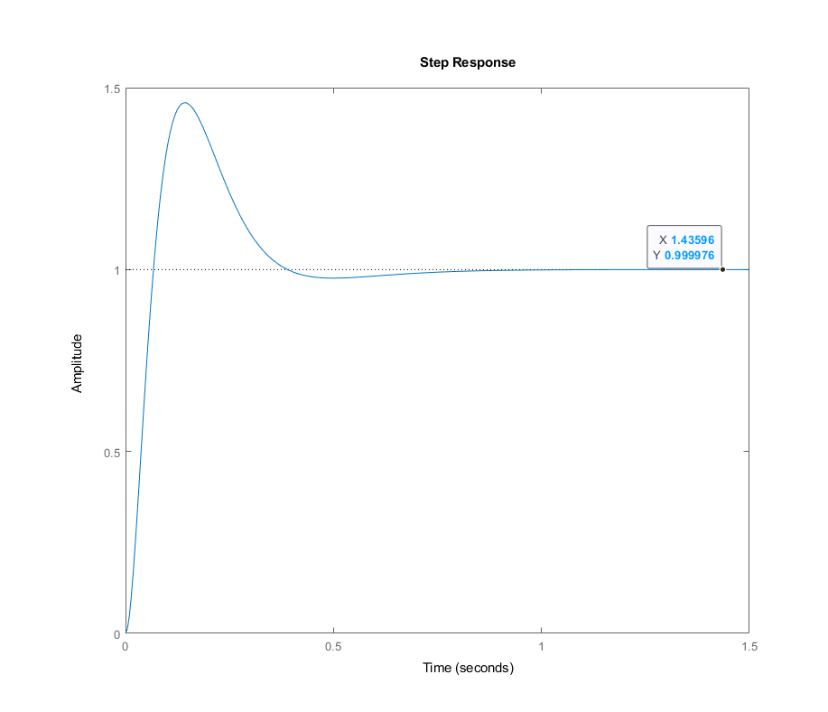
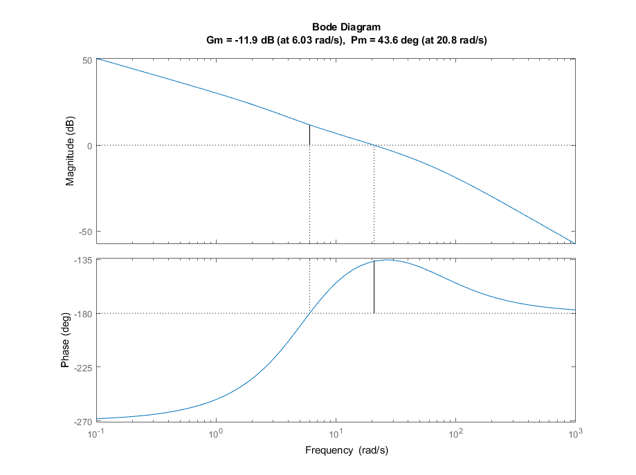
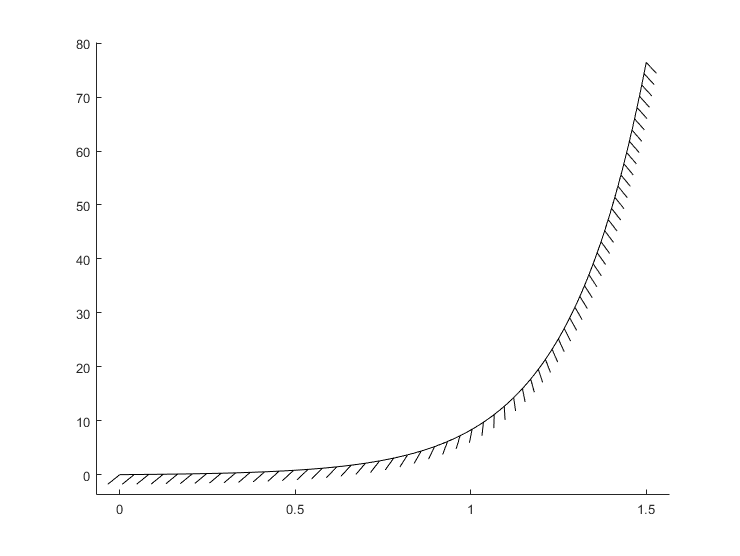
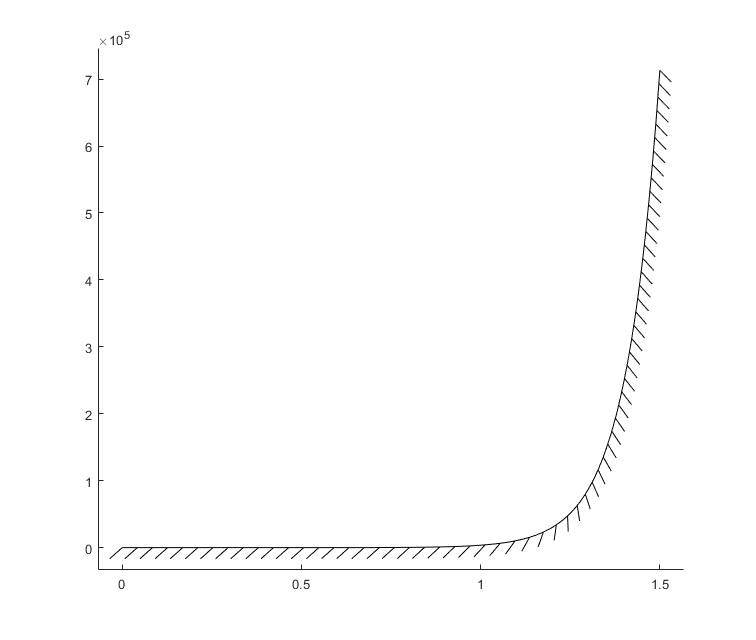
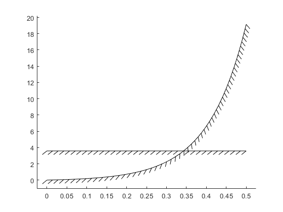

# Project 3 and 4

## Report from Yusu (Cosmo) Zhao, 20761282

## P3

1. The plant is not stable, thus we need to perform coprime factorization in order to perform Youla parameterization. We get:
   $$
   \begin{matrix}
    M(s) = \frac{(s + 4.427)(s - 4.427)}{(s+20)(s+10)} & N(s) = \frac{8}{(s+20)(s+10)} \\
    X(s) = \frac{1647(s+4.999)}{(s+20)(s+10)} & Y(s) = \frac{s^2 + 60s + 1320}{(s+20)(s+10)}
   \end{matrix}
   $$
   After the coprime factorization, now we can tell that the controller can be written in the following form by Youla parameterization:
   $$
   C(s) = \frac{X(s) + M(s)Q(s)}{Y(s) - N(s)Q(s)}
   $$
   To achieve perfect steady state tracking of steps:
   $$
   \begin{split}
    e_\infty &= \frac{1}{1 + P(0)C(0)} \\
    &= \frac{1}{1+\frac{N(0)}{M(0)} \frac{X(0) + M(0)Q(0)}{Y(0) - N(0)Q(0)}} \\
    &= M(0)Y(0) - N(0)M(0)Q(0) \\
    &= 0 \\
    \iff Q(0) &= \frac{Y(0)}{N(0)} \\
    &= \frac{6.5980}{0.0400} \\ 
    &= 164.9498
   \end{split}
   $$
   Let's choose a proper and stable $Q(s) = 164.9498$. Then, we can calculate our controller:
   $$
   C(s) = \frac{164.95(s^2 + 9.985s + 30.31)}{s(s+60)}
   $$
   We can see that there is an integrator, thus the system should achieve perfect steady-state tracking.
2. The closed-loop system can be calculated as:
   $$
   \frac{P(s)C(s)}{1+P(s)C(s)} =  \frac{1319.6(s^2 + 9,985s + 30.31)}{(s+20)^2 (s+10)^2}
   $$
   Then, the step response is:

   

   The system is stable, and the steady-state tracking error is zero since the steady-state value is one. 
   For transients, we can see that the system has a huge overshoot, almost $50\%$. The phase margin of $PC$ can be shown below:

   

   It is hard to intuitively figure out how to adjust $Q(s)$ for a better performance for the system, since the controller $C=\frac{X+MQ}{Y-NQ}$ given by Youla has a complicated form, and it is hard to understand how a change of $Q$ will affect the controller $C$

## P4
1. We consider the simple SISO system:
   * Since we assume we achieved perfect steady-state tracking, we have $y_\infty = 1$, and the unstable pole is at $p = 4.427$. Then, we can calculate the overshoot bound by:
   $$\begin{split}
   y_{OS} &\ge (1-0.9y_\infty)(e^{pt_r}-1) \\
   &=0.1(e^{4.427t_r} - 1)
   \end{split}$$
   The lower boundary line can be drawn as follows:

   

   where the y-axis is the overshoot minimum bound and the x-axis is rise time.
   * The plant has a relative degree of 2, thus we can directly apply the BSI:
   $$\begin{split}
    &\int_0^\infty \ln|S(j\omega)| d\omega = \pi \cdot \sum_{i=1}^{N_p} Re(p_i) \\
    \Rightarrow &\int_0^{0.1} \ln|S(j\omega)| d\omega + \int_{0.1}^\Omega\ln|S(j\omega)| d\omega + \int_\Omega^\infty \ln|S(j\omega)| d\omega \ge 4.427\pi
   \end{split}$$
   because there might be additional unstable poles from the controller.
   Assume we satisfy the specifications indicated, we have:
   $$\begin{split}
    &\int_0^{0.1} \ln|S(j\omega)| d\omega \le \int_0^{0.1} \ln|-20dB| d\omega = 0.1 \ln(0.1) \\
    &\int_{0.1}^\Omega\ln|S(j\omega)| d\omega \le \int_{0.1}^\Omega\ln|5dB| d\omega = (\Omega - 0.1) \ln (10^{\frac{1}{4}}) \\
    &\int_\Omega^\infty \ln|S(j\omega)| d\omega = \int_\Omega^\infty \ln|0dB| d\omega = 0
   \end{split}
   $$
   Therefore, we can conclude that:
   $$\begin{split}
    &0.1 \ln(0.1) + (\Omega - 0.1) \ln (10^{\frac{1}{4}}) \ge 4.427\pi \\
    \iff &(\Omega - 0.1) \ln (10^{\frac{1}{4}}) \ge 4.427\pi - 0.1 \ln(0.1) \\
    \iff &\Omega \ge \frac{4.427\pi - 0.1 \ln(0.1)}{\ln (10^{\frac{1}{4}})} + 0.1 \approx 24.66037647
   \end{split}
   $$
   Therefore, the lower bound on the value of $\Omega$ is around $24.66 \; rad/s$
   * If there is no unstable plant pole, the RHS of BSI should be zero. We can perform a similar process as above and get:
   $$\begin{split}
    &0.1 \ln(0.1) + (\Omega - 0.1) \ln (10^{\frac{1}{4}}) \ge 0 \\
    \iff &(\Omega - 0.1) \ln (10^{\frac{1}{4}}) \ge - 0.1 \ln(0.1) \\
    \iff &\Omega \ge \frac{- 0.1 \ln(0.1)}{\ln (10^{\frac{1}{4}})} + 0.1 = 0.5
   \end{split}
   $$
   Therefore, the new lower bound on value of $\Omega$ is now $0.5 \; rad/s$. The bound is lower. By having less plant poles, the RHS of BSI reduces value (in this case, it is zero). So the integral of $S(s)$ reduces value to zero, and we need fewer positive region to balance out the negative region.
2. For the two-rod system:
   * To calculate the overshoot, we can still use the same inequality we used earlier. However, there are two poles in this plant:
   $$
   y_{OS} \ge 0.1(e^{4.331t_r}-1) \\
   y_{OS} \ge 0.1(e^{10.52t_r}-1)
   $$
   We will choose the second one since it gives a more severe bound, as follows:

   
   
   where the y-axis is the overshoot minimum bound and the x-axis is rise time. This plot shows that the new system is necessarily more difficult to control because if we want to maintain the overshoot property, then we have to dramatically reduce the rise time/make the system faster to at least get some hope. Or, in other words, for the same rise time specification, the new system will necessarily have a much larger overshoot for the best case. 
   Using (1) on page 161, we can get that 
   $$
   y_{OS} \ge \frac{4.331}{5.539 - 4.331} \approx 3.585265
   $$
   This is a constant boundary which does not dependent on rise time. We can draw both bounds on the same graph with the same x,y-axis meanings:

   

   We can see that for rise time less than around 0.35 seconds, the constant bound should be used since it is higher, and for greater rise time the exponential bound should be used. 
   * The plant has a relative degree of 2, thus we can directly apply the BSI:
   $$\begin{split}
    &\int_0^\infty \ln|S(j\omega)| d\omega = \pi \cdot \sum_{i=1}^{N_p} Re(p_i) \\
    \Rightarrow &\int_0^{0.1} \ln|S(j\omega)| d\omega + \int_{0.1}^\Omega\ln|S(j\omega)| d\omega + \int_\Omega^\infty \ln|S(j\omega)| d\omega \ge (4.331+10.52)\pi
   \end{split}$$
   because there might be additional unstable poles from the controller.
   Assume we satisfy the specifications indicated, we have:
   $$\begin{split}
    &\int_0^{0.1} \ln|S(j\omega)| d\omega \le \int_0^{0.1} \ln|-20dB| d\omega = 0.1 \ln(0.1) \\
    &\int_{0.1}^\Omega\ln|S(j\omega)| d\omega \le \int_{0.1}^\Omega\ln|5dB| d\omega = (\Omega - 0.1) \ln (10^{\frac{1}{4}}) \\
    &\int_\Omega^\infty \ln|S(j\omega)| d\omega = \int_\Omega^\infty \ln|0dB| d\omega = 0
   \end{split}
   $$
   Therefore, we can conclude that:
   $$\begin{split}
    &0.1 \ln(0.1) + (\Omega - 0.1) \ln (10^{\frac{1}{4}}) \ge 14.851\pi \\
    \iff &(\Omega - 0.1) \ln (10^{\frac{1}{4}}) \ge 14.851\pi - 0.1 \ln(0.1) \\
    \iff &\Omega \ge \frac{14.851\pi - 0.1 \ln(0.1)}{\ln (10^{\frac{1}{4}})} + 0.1 \approx 84.54941292
   \end{split}
   $$
   Therefore, the lower bound on the value of $\Omega$ is around $84.55 \; rad/s$
   * The plant has a unstable zero, thus we can directly apply the Poisson Integral:
   $$\begin{split}
    &\int_0^\infty \ln|S(j\omega)| W(\omega) d\omega = \pi \cdot \sum_{i=1}^{N_p} \left|\frac{p_i+z}{p_i^* - z} \right| \\
    \Rightarrow &
    \int_0^{0.1} \ln|S(j\omega)| W(\omega) d\omega +
    \int_{0.1}^\Omega \ln|S(j\omega)| W(\omega) d\omega +
    \int_\Omega^\infty \ln|S(j\omega)| W(\omega) d\omega \ge \left(\ln\left|\frac{4.331+5.539}{4.331-5.539}\right| +\ln\left|\frac{10.52+5.539}{10.52-5.539}\right|\right)\pi \\
    \Rightarrow & \int_0^{0.1} \ln|S(j\omega)| W(\omega) d\omega +
    \int_{0.1}^\Omega \ln|S(j\omega)| W(\omega) d\omega +
    \int_\Omega^\infty \ln|S(j\omega)| W(\omega) d\omega \ge 3.27117252 \pi
   \end{split}$$
   because there might be additional unstable poles from the controller, where $W(s) = \frac{2z}{z^2 + \omega^2}$
   Assume we satisfy the specifications indicated, we have:
   $$\begin{split}
    &\int_0^{0.1} \ln|S(j\omega)| W(\omega) d\omega \le \ln(0.1) \int_0^{0.1} \frac{2z}{z^2 + \omega^2} d\omega\\
    &\int_{0.1}^\Omega\ln|S(j\omega)| W(\omega) d\omega \le \int_{0.1}^\Omega\ln|5dB| d\omega = \ln (10^{\frac{1}{4}})\int_{0.1}^\Omega  \frac{2z}{z^2 + \omega^2} d\omega\\
    &\int_\Omega^\infty \ln|S(j\omega)| W(\omega) d\omega = \ln|0dB| \int_\Omega^\infty  \frac{2z}{z^2 + \omega^2} d\omega = 0
   \end{split}
   $$
   To calculate the integral, we change the variable $\omega = zv, z = 5.539$, so $d\omega = zdv$, and we have:
   $$
   \begin{split}
   \int_a^b \frac{2z}{z^2 + \omega^2} d\omega
   &= 2 \int_\frac{a}{z}^\frac{b}{z} \frac{z^2}{z^2 + (zv)^2} dv \\
   &= 2 \int_\frac{a}{z}^\frac{b}{z} \frac{1}{1 + v^2} dv \\
   &= 2\left(\arctan \frac{b}{z} - \arctan \frac{a}{z}\right)
   \end{split}
   $$
   So we have:
   $$\begin{split}
    &\int_0^{0.1} \ln|S(j\omega)| W(\omega) d\omega \le -2\ln(10) \arctan \frac{0.1}{5.539}\\
    &\int_{0.1}^\Omega\ln|S(j\omega)| W(\omega) d\omega \le \frac{1}{2}\ln (10) \left(\arctan \frac{\Omega}{5.539} - \arctan \frac{0.1}{5.539} \right)\\
   \end{split}
   $$
   Therefore, we can conclude that:
   $$\begin{split}
    &-2\ln(10) \arctan \frac{0.1}{5.539} + \frac{1}{2}\ln (10) \left(\arctan \frac{\Omega}{5.539} - \arctan \frac{0.1}{5.539} \right) \ge 3.27117252 \pi \\
    \iff &\frac{1}{2}\ln (10) \arctan \frac{\Omega}{5.539} -  \frac{5}{2} \ln {10} \arctan \frac{0.1}{5.539} \ge 3.27117252 \pi \\
    \iff &\arctan \frac{\Omega}{5.539} \ge 2 \frac{3.27117252 \pi + \frac{5}{2} \ln {10} \arctan \frac{0.1}{5.539}}{\ln10} \approx 9.016480067
   \end{split}
   $$
   However, we know that the range of function $\arctan$ is $(-\frac{\pi}{2}, \frac{\pi}{2})$. Therefore, there is no value of $\Omega$ that can achieve the requirement calculated, $\arctan \frac{\Omega}{5.539} \ge 9.016480067$. 